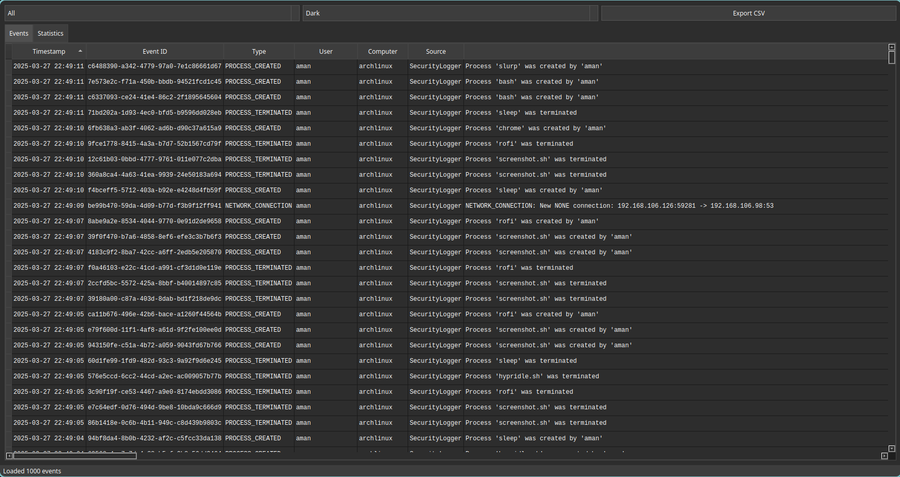

# Windows-Style Security Event Logger for Linux
A Python-based security event monitoring system for Linux that emulates Windows Event Log functionality. Captures and logs security-related events in a structured format, complete with Windows-style event IDs and categories.
 <!-- Screenshot -->
---
## Features
- **Windows Event Log Formatting**  
  Logs events with familiar Windows Event IDs (e.g., `4624` for successful logins) and types (Information, Warning, Error).
- **Dual Interface**  
  Run in **terminal mode** (`security_logger.py`) for CLI operations or launch the **GUI** (`gui.py`) for visual interaction.
- **Real-Time Monitoring**  
  Tracks authentication logs, file changes, network activity, and processes.
- **SQLite Database**  
  Stores events in `/var/log/securityevents.db` by default for query and analysis.
- **Systemd Service**  
  Supports installation as a background service for 24/7 monitoring.
---
## Installation
### Prerequisites
- **Python 3.8+**
- **System Packages** (for full functionality):
  ```bash
  # For Debian/Ubuntu
  sudo apt install auditd systemd python3-tk
  # For Fedora
  sudo dnf install audit systemd python3-tkinter
  ```
### Setup
1. Clone the repository:
   ```bash
   git clone https://github.com/yourusername/security-event-logger.git
   cd security-event-logger
   ```
2. Create and activate a virtual environment:
   ```bash
   python -m venv venv
   source venv/bin/activate
   ```
3. Install Python dependencies:
   ```bash
   pip install -r requirements.txt
   ```
4. **Configure the application**:
   ```bash
   # Copy the default configuration file
   cp config/default_config.ini config/config.ini
   # Edit the config file if needed (e.g., database path)
   nano config/config.ini
   ```
5. **Set Permissions** (if using default `/var/log` paths):
   ```bash
   sudo mkdir -p /var/log
   sudo touch /var/log/securityevents.{db,log}
   sudo chown $USER:$USER /var/log/securityevents.*
   ```
6. **Verify Installation**:
   ```bash
   # Run in terminal mode
   python security_logger.py --verbose
   # Test GUI (requires tkinter)
   python gui.py
   ```
---
## Usage
### Terminal Mode (CLI)
```bash
# Start the logger in terminal
python security_logger.py [--verbose|--daemon|--list-events|--search]
# Examples:
python security_logger.py --verbose          # Debug mode
python security_logger.py --list-events      # Show recent 100 events
python security_logger.py --search "event_id = '4625'"  # Filter failed logins
```
### GUI Mode
```bash
# Launch the graphical interface
python gui.py
```
> **Note**: The GUI is a work-in-progress (WIP). Ensure GUI dependencies (e.g., `tkinter`) are installed.
### Systemd Service
```bash
# Install and start as a background service (requires root)
sudo python security_logger.py --install-service
sudo systemctl status seclog.service         # Verify status
```
---


## Notes on GUI and Terminal Issues
### GUI Issues
1. **Missing `tkinter`**:
   - If the GUI fails to launch, ensure `tkinter` is installed:
     ```bash
     # Debian/Ubuntu
     sudo apt install python3-tk
     # Fedora
     sudo dnf install python3-tkinter
     ```
   - If the issue persists, run the application in terminal mode (`security_logger.py`).
2. **GUI Crashes**:
   - The GUI is a **work-in-progress** and may crash on unsupported systems or configurations.
   - Check the terminal for error messages and report them in the [Issues](https://github.com/yourusername/security-event-logger/issues) section.
3. **Limited Features**:
   - The GUI currently supports basic event viewing and filtering. Advanced features (e.g., real-time alerts) are only available in terminal mode.
### Terminal Issues
1. **Permission Denied**:
   - If running without root privileges, some events (e.g., `auditd`, `journald`) may not be captured.
   - Run with `sudo` for full functionality:
     ```bash
     sudo python security_logger.py --verbose
     ```
2. **Database Locked**:
   - If the database file (`/var/log/securityevents.db`) is locked, ensure no other instance of the logger is running.
   - Restart the application or delete the database file (if not needed).
3. **Missing Logs**:
   - Ensure the monitored log files (e.g., `/var/log/auth.log`) exist and are readable.
   - Adjust the `config.ini` file to include valid paths.
---
## Project Structure
```
.
├── config/               # Configuration files
│   ├── default_config.ini  # Template configuration
│   └── config.ini          # Active configuration (create via setup)
├── monitors/             # Monitoring modules (auth logs, network, etc.)
├── event_database.py     # SQLite database handler
├── security_logger.py    # Terminal-mode application
├── gui.py                # Graphical User Interface (WIP)
└── logs/                 # Log storage directory
```
---
## Maintainers
- [Yasir Hameed](https://github.com/cyberpunk47) (Primary Developer)
- [MD Aquib Raza](https://github.com/razaaquib99) (Co-Developer)
---
## Contributing
1. Fork the repository.
2. Create a feature branch:  
   `git checkout -b feature/your-feature`
3. Commit changes:  
   `git commit -m 'Add some feature'`
4. Push to the branch:  
   `git push origin feature/your-feature`
5. Open a **Pull Request**.
---
## License
MIT License. See [LICENSE](LICENSE) for details.